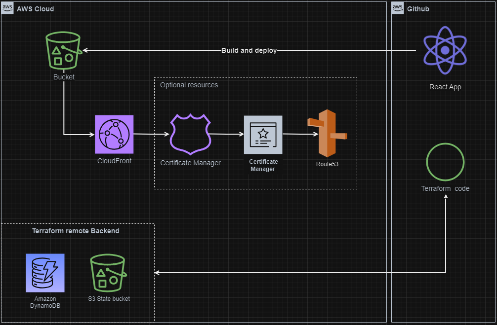

# React applicaton Landing Page terraform template

### Architecture Diagram

## Description
This solution creates an AWS infrastructure via terrafrm to host React application in s3 bucket and Cloudfront

## Usage
#### To start using this solution you have to do following steps:
1.  Create Secrets in github AWS_ACCESS_KEY_ID and AWS_SECRET_ACCESS_KEY
2.  Create variables BUCKET_NAME and REGION (optionally DOMAIN_NAME )
3.  Go to actions section and run manually workflows in following order:
   * S3 state infrastructure creation -> Creates S3 bucket and DynamoDB table to store Terraform remote state in AWS (this step needs to be manually triggered only once)
   * Plan Infrastructure creation -> creates a Terraform Plan output with infrastructure planned to be created in AWS
   * Apply Infrastructure, build and deploy App to CloudFront ->
     - Creates AWS infrastructure you seen in previous step
     - Deploys dependencies for React application and Builds it
     - Copies all data from build folder to s3 bucket and doing cloudfront invalidation.
   * Go to to Actions and find workflows that successfully finished:
     - In "Apply Infrastructure, build and deploy App to CloudFront" workflow find Terraform apply step
     - Scroll to the bottom to Terraform outputs block and copy outpu "website_endpoint" -> this is the link to our React web application
 4. Optional step. If you have your registered domain you need to:
   * uncomment context of following files: hosted-zones.tf, acm.tf and cloudfront.tf (line 11-12)
   * Continue from step 2 and below
   * Access React application using Github variable "DOMAIN_NAME"

## Tech Stack
* React
* Styled Components
* React Router
* React Hooks
* Terraform
